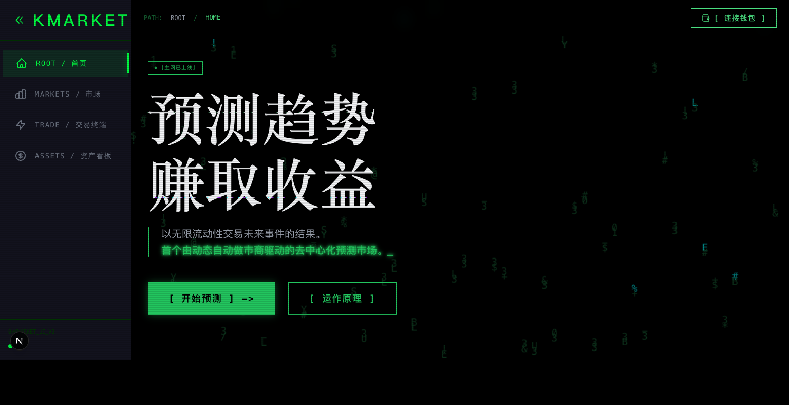

# KMarket Contracts

> Cross-chain prediction market smart contracts powered by **[Reactive Network](https://reactive.network/)** — autonomous cross-chain deposits and self-breathing treasury, all driven by on-chain event subscriptions with zero reliance on off-chain bots or oracles.

## Demo Video

[](https://www.bilibili.com/video/BV11WXUB1EkC/)

▶️ **[Watch the full demo on Bilibili](https://www.bilibili.com/video/BV11WXUB1EkC/)**

## Overview

KMarket is a real-time grid-based prediction market where users bet on crypto price movements (ETH, BTC) within dynamic tick ranges. Each bet locks USDC, and the outcome is automatically settled based on the expiry price.

**What makes KMarket unique is the Reactive Network integration:**

1. **Trustless Cross-Chain Deposits** — A user locks USDC on Arbitrum → Reactive Network detects the event → automatically credits the user's balance on Polygon. No bridge UI, no manual claim, no off-chain relayer.

2. **Self-Breathing Treasury** — The vault's liquidity state is monitored in real time by a Reactive Smart Contract. When utilization is low, idle USDC is automatically deployed to Aave V3 for yield. When liquidity tightens, funds are automatically pulled back. The treasury "breathes" without any human intervention or cron jobs.

## Architecture

```
Arbitrum (Origin)           Reactive Network (ReactVM)           Polygon (Destination)
┌─────────────────┐    ┌────────────────────────────────┐    ┌─────────────────────────┐
│  OriginLockBox  │    │                                │    │     KMarketVault        │
│  User locks     │───▶│  ReactiveDepositRouter (RSC)   │───▶│  creditCrossChainDeposit│
│  USDC here      │    │  Monitors: Deposited event     │    │                         │
└─────────────────┘    │  Action:  Credit on Polygon    │    │  LiquidityStateUpdated  │──┐
                       └────────────────────────────────┘    │         event           │  │
                       ┌────────────────────────────────┐    │                         │  │
                    ┌──│ ReactiveLiquidityGuardian (RSC) │◀───│                         │  │
                    │  │ Monitors: LiquidityStateUpdated │    │                         │  │
                    │  │ Action:  Trigger rebalance      │    │  ┌───────────────────┐  │  │
                    │  └────────────────────────────────┘    │  │ KMarketSettlement │  │  │
                    │                                        │  │ Batch/Self settle │──┤  │
                    │        Callback                        │  └───────────────────┘  │  │
                    ▼                                        │                         │  │
         ┌─────────────────────┐                             │  ┌───────────────────┐  │  │
         │ TreasuryRebalancer  │◀───────────────────────────▶│  │SessionKeyRegistry │  │  │
         │  (deploy/pull USDC) │     rebalanceOut/In         │  └───────────────────┘  │  │
         └────────┬────────────┘                             └─────────────────────────┘  │
                  │                                                                       │
                  ▼                                                                       │
         ┌─────────────────────┐                                                          │
         │   AaveAdapter       │                                                          │
         │   (Aave V3 yield)   │◀─────────────────────────────────────────────────────────┘
         └─────────────────────┘
```

## Deployed Contracts

### Reactive Smart Contracts (Reactive Network — Kopli Testnet)

| Contract | Address |
|----------|---------|
| **ReactiveDepositRouter** | [`0x75DBbA4Aa772946741618396b27f476Bb7748063`](https://kopli.reactscan.net/address/0x75DBbA4Aa772946741618396b27f476Bb7748063) |
| **ReactiveLiquidityGuardian** | [`0x2A53CC4BEF24FCfa449F58069b7D7fcC70640f33`](https://kopli.reactscan.net/address/0x2A53CC4BEF24FCfa449F58069b7D7fcC70640f33) |

### Origin Chain (Amoy Testnet)

| Contract | Address |
|----------|---------|
| **OriginLockBox** | [`0x40aC39b1bD26C65D5FaE878BF798f71d4f68F2CC`](https://amoy.polygonscan.com/address/0x40aC39b1bD26C65D5FaE878BF798f71d4f68F2CC) |

### Destination Chain (Amoy Testnet)

| Contract | Address |
|----------|---------|
| **KMarketVault** | [`0x2Da0608f5D82E7b435d6654d474b7DD2E5946A12`](https://amoy.polygonscan.com/address/0x2Da0608f5D82E7b435d6654d474b7DD2E5946A12) |
| **AaveAdapter** | [`0xe6Efdd891994E342Bff6F7038CB5a756F50CA520`](https://amoy.polygonscan.com/address/0xe6Efdd891994E342Bff6F7038CB5a756F50CA520) |
| **VaultReceiver** | [`0x0B466d566281879A84E4887624C6544A197596F9`](https://amoy.polygonscan.com/address/0x0B466d566281879A84E4887624C6544A197596F9) |
| **RebalanceReceiver** | [`0x25981458c26c086A9F6b505fD52674a94fBcce02`](https://amoy.polygonscan.com/address/0x25981458c26c086A9F6b505fD52674a94fBcce02) |

## How Reactive Network Is Used

### Problem 1: Cross-Chain Deposits Without a Bridge

Traditional cross-chain deposits require either a centralized bridge operator, a multi-sig relayer, or an optimistic/zk bridge with long finality. These add latency, trust assumptions, and operational overhead.

**Our solution with Reactive Network:**

The `ReactiveDepositRouter` is a Reactive Smart Contract (RSC) deployed on ReactVM. It subscribes to `Deposited` events emitted by `OriginLockBox` on the origin chain:

```solidity
// In ReactiveDepositRouter constructor:
SERVICE.subscribe(
    originChainId,        // Origin chain (e.g., Arbitrum)
    address(lockBox),     // OriginLockBox contract
    DEPOSITED_TOPIC,      // keccak256("Deposited(bytes32,address,address,uint256,uint256)")
    REACTIVE_IGNORE,      // wildcard topic filters
    REACTIVE_IGNORE,
    REACTIVE_IGNORE
);
```

When a user calls `OriginLockBox.deposit(amount, polygonReceiver)`, the RSC's `react()` function fires automatically:

1. Decodes `depositId`, `receiver`, `amount` from the event log
2. Checks idempotency (`processedDeposits[depositId]`)
3. Emits a `Callback` targeting `KMarketVault.creditCrossChainDeposit(depositId, receiver, amount)` on Polygon
4. The Reactive Relayer executes this callback on Polygon, crediting the user's balance

**No off-chain bot. No keeper. No oracle. Fully autonomous.**

### Problem 2: Idle Treasury Funds Earning Zero Yield

A prediction market vault holds large amounts of USDC as LP liquidity, but utilization fluctuates. During low-activity periods, the majority of funds sit idle.

**Our solution with Reactive Network:**

The `ReactiveLiquidityGuardian` subscribes to `LiquidityStateUpdated` events from `KMarketVault`:

```solidity
// KMarketVault emits after every state change:
emit LiquidityStateUpdated(lpPool, totalUserDeposits, totalLockedBalance, block.timestamp);
```

The Guardian calculates utilization in basis points and autonomously decides:

| Utilization | Water Level | Action |
|-------------|-------------|--------|
| < 60% | HEALTHY | Deploy excess USDC to Aave V3 for yield |
| 60% – 90% | LOW | Pull funds from Aave back to Vault |
| > 90% | CRITICAL | Emergency: withdraw ALL from Aave |

This triggers `TreasuryRebalancer.rebalance(level, adapter, amount)` via Reactive Callback, which then executes `vault.rebalanceOut()` or `vault.rebalanceIn()` + `AaveAdapter.deposit()/withdraw()`.

**The treasury "breathes" — expanding into yield when idle, contracting when liquidity is needed — all without any cron job, keeper bot, or manual intervention.**

## Verified Transaction Hashes

### Flow A: Cross-Chain Deposit (Origin → Reactive → Destination)

| Step | Description | Transaction Hash |
|------|-------------|-----------------|
| 1 | USDC Approve | [`0x9faf3438...193e0f`](https://amoy.polygonscan.com/tx/0x9faf34380027d525b00289057f972a350d3d5ab4649df01d7f201d6d73193e0f) |
| 2 | Lock USDC in OriginLockBox | [`0x9aa54b6f...b294f1`](https://amoy.polygonscan.com/tx/0x9aa54b6ffdaa8524762035b38cc5128e56a478178481aca3bd2b5b3c4eb294f1) |
| 3 | ReactiveDepositRouter react() | [`0x1d6644b3...def61f3`](https://kopli.reactscan.net/tx/0x1d6644b3526bb05b7ae3e2c31045ece1eeb2597cae6719a643fd8b5ebdef61f3) |
| 4 | Vault credits user balance | [`0xe5512a84...7d2684f`](https://amoy.polygonscan.com/tx/0xe5512a843ca4579c85bf3f2f13503ad81bba0abccee230470358e6c9a7d2684f) |

**Result:** `processedDeposits = true` — Vault user balance updated to `500000000` (500 USDC, 6 decimals).

### Flow B: Autonomous Treasury Rebalancing (Vault → Reactive → Aave)

| Step | Description | Transaction Hash |
|------|-------------|-----------------|
| 1 | LP approves USDC | [`0x2e268ae5...999da30`](https://amoy.polygonscan.com/tx/0x2e268ae5a96f1b267c041c25ec74a024d47de3ac816eee26207bbbd0e999da30) |
| 2 | LP deposits into Vault | [`0x70ac4a02...1b0964c`](https://amoy.polygonscan.com/tx/0x70ac4a027c7aed0e9575c2484aecc790d78c21a90a20433be722f87fe1b0964c) |
| 3 | Set Guardian thresholds | [`0x42d96d56...c95e1e`](https://kopli.reactscan.net/tx/0x42d96d568e848b62f5b3c590584362dd5e19a1f18d008ee736a079ad27c95e1e) |
| 4 | Guardian detects low utilization | [`0x97fea38c...d5b9d38`](https://kopli.reactscan.net/tx/0x97fea38c72a0b6c8c6dbf6ee0bac40c3fb3a439004c62ab9d8d0fab41d5b9d38) |
| 5 | Rebalancer deploys to Aave | [`0x15b74e80...cd607b0d`](https://amoy.polygonscan.com/tx/0x15b74e805597ab2eb0c9ee90f0043bd1a650d4b082857f95a8ba5e38cd607b0d) |

**Result:** Guardian detected HEALTHY water level (low utilization) → TreasuryRebalancer deployed idle USDC to Aave V3 → `AaveAdapter.totalAssets() = 325000000` (325 USDC now earning yield).

## Contract Details

### KMarketVault

Central fund pool on Polygon. Manages user deposits, LP pool, cross-chain credits, settlement, and treasury rebalancing.

**Key features:**
- **3-tier withdrawals**: Fast (Sequencer EIP-712 signed, instant), Slow (120s delay), Emergency (7-day delay)
- **LP pool**: Proportional share-based liquidity provision
- **Cross-chain credits**: Idempotent via `processedDeposits[depositId]`
- **Role-based access**: `SETTLEMENT_ROLE`, `SEQUENCER_ROLE`, `BRIDGE_ROLE`, `REBALANCER_ROLE`
- **Liquidity state emission**: `LiquidityStateUpdated` event after every state change — consumed by ReactiveLiquidityGuardian

### KMarketSettlement

Batch settlement engine with EIP-712 Oracle signature verification and Merkle proof storage.

- **`batchSettle()`**: Sequencer submits batch with Oracle signature → adjusts user balances in Vault
- **`selfSettleAll()`**: Users can self-settle with Oracle-signed seal
- **`verifyOrder()`**: Merkle proof verification for individual order inclusion

### OriginLockBox

Deployed on origin chains (Arbitrum). Users lock USDC here; the `Deposited` event triggers the Reactive cross-chain flow.

- Per-transaction cap (`singleCap`) and rolling 24h volume cap (`dailyCap`)
- Deterministic `depositId` generation
- Owner-controlled refunds for stuck deposits

### TreasuryRebalancer

Yield deployment router. Called by ReactiveLiquidityGuardian (via Callback) or authorized keepers.

- **HEALTHY** → `_deployToYield()` → sends idle USDC to Aave
- **LOW** → `_pullFromYield()` → retrieves partial USDC from Aave
- **CRITICAL** → `_emergencyPullAll()` → withdraws 100% from Aave

### AaveAdapter

Implements `IYieldAdapter`. Deposits/withdraws USDC into Aave V3 Pool. Only callable by TreasuryRebalancer.

### SessionKeyRegistry

On-chain session key management. Users authorize temporary keys with expiry, spending limits, and permission bitmasks (`BET=1`, `CANCEL=2`, `SETTLE=4`) for gasless delegated betting.

## Post-Deployment Workflow

1. **User deposits on origin chain**: `OriginLockBox.deposit(amount, polygonReceiver)` → USDC locked, `Deposited` event emitted
2. **RSC routes deposit**: `ReactiveDepositRouter.react()` fires (~15s) → emits `Callback` to Polygon
3. **Vault credits balance**: Reactive Relayer executes `creditCrossChainDeposit()` → user balance updated (accounting-only, no ERC20 transfer per bet)
4. **User places bets**: Backend locks bet amount via `updateLockedBalance()` — off-chain matching, batch settlement
5. **Batch settlement**: Sequencer aggregates orders → Oracle signs EIP-712 → `batchSettle()` → winners/losers balanced, net delta adjusts LP pool
6. **Liquidity state emitted**: Every state change triggers `_emitLiquidityState()` → `LiquidityStateUpdated` event
7. **Guardian rebalances**: RSC detects event → evaluates water level → triggers `TreasuryRebalancer.rebalance()` → idle USDC flows to/from Aave
8. **User withdraws**: Fast (Sequencer EIP-712 sig), Slow (120s delay), or Emergency (7-day delay)

## Tech Stack

| Technology | Version | Purpose |
|-----------|---------|---------|
| Solidity | 0.8.24 | Smart contracts (Cancun EVM) |
| Foundry | Latest | Build, test, deploy (`via_ir = true`) |
| OpenZeppelin | 5.x | AccessControl, Pausable, ReentrancyGuard, ECDSA, EIP712 |
| Aave V3 | - | Yield generation for idle USDC |
| Reactive Network | - | Cross-chain event-driven automation (ReactVM) |
| EIP-712 | - | Typed structured data signing (Oracle settlement, Sequencer fast withdrawals) |

## Build & Test

```bash
# Install dependencies
forge install

# Build
forge build

# Run all tests (88 tests)
forge test

# Run with verbosity
forge test -vvv

# Gas report
forge test --gas-report

# Format
forge fmt
```

## Project Structure

```
src/
├── bridge/
│   └── OriginLockBox.sol              # Origin chain: USDC lock box
├── interfaces/
│   ├── IKMarketVault.sol
│   ├── IKMarketSettlement.sol
│   ├── IOriginLockBox.sol
│   ├── ISessionKeyRegistry.sol
│   └── IYieldAdapter.sol
├── reactive/
│   ├── AbstractReactive.sol           # Base RSC with Callback emission
│   ├── IReactive.sol
│   ├── ISubscriptionService.sol
│   ├── ReactiveDepositRouter.sol      # RSC: cross-chain deposit automation
│   └── ReactiveLiquidityGuardian.sol  # RSC: treasury rebalancing automation
├── registry/
│   └── SessionKeyRegistry.sol         # Session key management
├── settlement/
│   └── KMarketSettlement.sol          # Batch settlement with EIP-712
├── treasury/
│   ├── AaveAdapter.sol                # Aave V3 yield adapter
│   └── TreasuryRebalancer.sol         # Yield deployment router
└── vault/
    └── KMarketVault.sol               # Central fund pool

script/
└── Deploy.s.sol                       # Deploy, DeployOrigin, DeployAaveAdapter

test/
├── KMarketVault.t.sol
├── KMarketSettlement.t.sol
├── SessionKeyRegistry.t.sol
├── TreasuryRebalancer.t.sol
├── CrossChainDeposit.t.sol
└── mocks/
```

## Security

- **Role-based Access Control** — Separate `SETTLEMENT_ROLE`, `SEQUENCER_ROLE`, `BRIDGE_ROLE`, `REBALANCER_ROLE` via OpenZeppelin AccessControl
- **Reentrancy Protection** — `ReentrancyGuard` on all external state-changing functions
- **Pausable** — Admin can pause the entire Vault in emergencies
- **EIP-712 Signatures** — Typed structured data prevents signature replay across contracts and chains
- **Nonce Tracking** — Per-user nonces for fast withdrawals, per-pool nonces for settlements
- **Idempotency** — Cross-chain deposits tracked via `processedDeposits[depositId]` in both RSC and Vault
- **Rate Limiting** — OriginLockBox enforces per-tx and daily volume caps; Guardian has cooldown between callbacks
- **3-Tier Withdrawals** — Fast (instant, sequencer-signed), Slow (120s delay), Emergency (7-day delay) — defense in depth

## License

MIT
